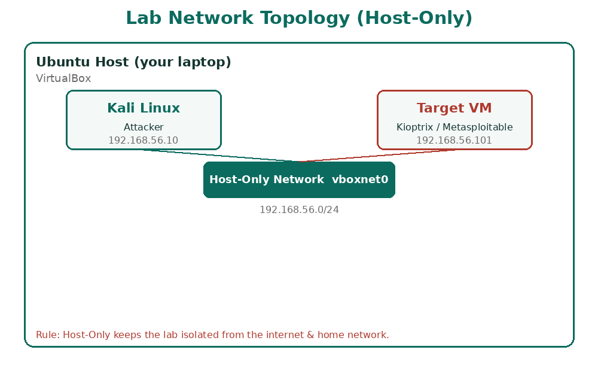
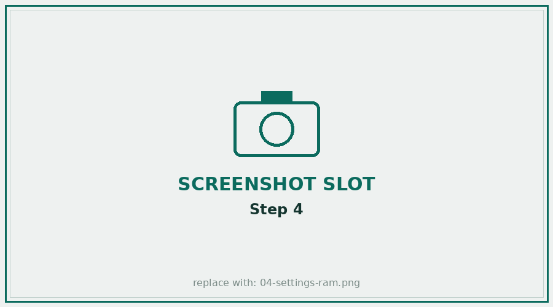
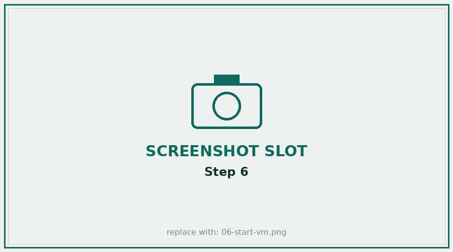
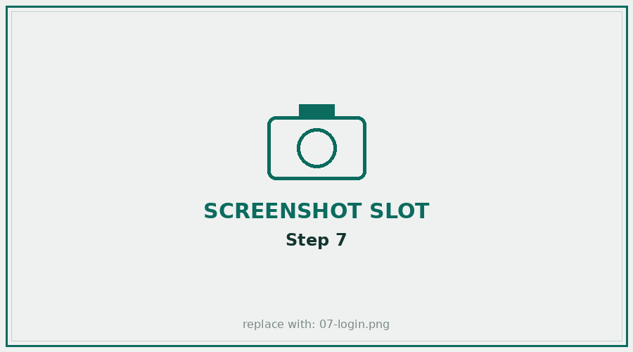
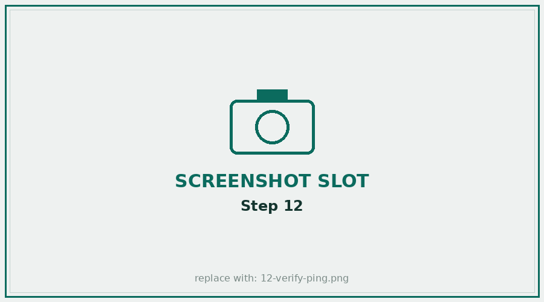

<div dir="rtl">

# 🖥️ מדריך הקמת המעבדה — צעד אחר צעד (עם צילומי מסך)

מדריך מפורט לתלמידים, **צעד-אחר-צעד**, להקמת מעבדת ההאקינג על **Ubuntu עם VirtualBox**. עקוב בדיוק לפי הסדר. כל שלב כולל **מקום לצילום מסך** — כך תראה בדיוק מה אמור להופיע על המסך שלך.

> 📸 **לגבי צילומי המסך:** התמונות המסומנות "SCREENSHOT SLOT" הן מצייני-מקום. **צלם את המסך שלך** בכל שלב (ב-Ubuntu: מקש `PrtSc`, או אפליקציית "Screenshot"), שמור בשם המצוין תחת `resources/images/`, והתמונה האמיתית תחליף את מציין-המקום. כך המדריך יהיה מותאם בדיוק לסביבה שלך.

---

## מפת המעבדה שנבנה



**היעד:** מכונת **Kali** (התוקף) ומכונת **מטרה** (Kioptrix/Metasploitable), שתיהן ברשת **Host-Only** מבודדת — כך שהן רואות זו את זו אך מנותקות מהאינטרנט ומהרשת הביתית.

---

## שלב 1 — התקנת VirtualBox על Ubuntu

פתח Terminal (`Ctrl+Alt+T`) והרץ:
```bash
sudo apt update
sudo apt install virtualbox virtualbox-ext-pack -y
```
פתח את VirtualBox מתפריט האפליקציות.

📸 **צילום מסך:** חלון VirtualBox Manager ריק לאחר פתיחה ראשונה.


---

## שלב 2 — הורדת דמות ה-VM של Kali

1. גלוש ל-**[kali.org/get-kali](https://www.kali.org/get-kali/#kali-virtual-machines)**.
2. בחר בלשונית **Virtual Machines**.
3. הורד את גרסת **VirtualBox** (קובץ `.7z` שמכיל `.vbox` + `.vdi`), 64-bit.
4. חלץ את הארכיון:
```bash
cd ~/Downloads
sudo apt install p7zip-full -y
7z x kali-linux-*-virtualbox-amd64.7z
```

📸 **צילום מסך:** עמוד ההורדה של Kali עם אפשרות ה-VirtualBox מסומנת.


---

## שלב 3 — הוספת מכונת Kali ל-VirtualBox

1. ב-VirtualBox: **Machine → Add** (או `Ctrl+A`).
2. נווט לתיקייה שחילצת ובחר את קובץ ה-**`.vbox`**.
3. Kali תופיע ברשימת המכונות משמאל.

📸 **צילום מסך:** Kali מופיעה ברשימת המכונות ב-VirtualBox Manager.


---

## שלב 4 — הגדרות המכונה (RAM ומעבד)

1. בחר את Kali → **Settings → System**.
2. **Motherboard → Base Memory:** הגדר **2048MB** לפחות (מומלץ 4096MB אם יש 8GB+).
3. **Processor:** הגדר **2** ליבות.

> 💡 במחשב עם 8GB RAM — תן ל-Kali 2–4GB, והרץ **מכונת מטרה אחת** בכל פעם.

📸 **צילום מסך:** מסך ה-System עם ה-RAM והמעבד שהגדרת.


---

## שלב 5 — הגדרת רשת מבודדת (קריטי! 🔒)

1. Settings → **Network → Adapter 1**.
2. **Attached to:** בחר **Host-Only Adapter** (או **NAT** אם צריך אינטרנט לעדכונים).
3. אם אין רשת Host-Only — צור אחת: **File → Host Network Manager → Create**.

> ⚠️ **לעולם אל תבחר Bridged** בזמן תרגול תקיפה — זה חושף את הרשת הביתית האמיתית.

📸 **צילום מסך:** הגדרת הרשת עם Host-Only Adapter נבחר.


---

## שלב 6 — הפעלת המכונה

בחר את Kali ולחץ **Start** (החץ הירוק).

📸 **צילום מסך:** Kali עולה (מסך ה-boot / מסך ההתחברות).


---

## שלב 7 — התחברות

בפרטי ההתחברות הקלד:
- **Username:** `kali`
- **Password:** `kali`

📸 **צילום מסך:** שולחן העבודה של Kali אחרי התחברות מוצלחת.


---

## שלב 8 — עדכון Kali

פתח Terminal והרץ (הזן `kali` כשתתבקש סיסמה):
```bash
sudo apt update && sudo apt full-upgrade -y
```

📸 **צילום מסך:** ה-Terminal עם העדכון רץ/מסתיים.


---

## שלב 9 — צילום מצב נקי (Snapshot)

**חשוב מאוד:** לפני כל תרגול, שמור מצב נקי כדי שתוכל לחזור אליו.
ב-VirtualBox: בחר את Kali → **Snapshots → Take** → תן שם `Kali-clean`.

📸 **צילום מסך:** חלון ה-Snapshots עם ה-Snapshot הנקי.


---

## שלב 10 — הורדת מכונת מטרה

הורד מכונה פגיעה לתרגול (בחר אחת להתחלה):
- **Metasploitable 2** — [SourceForge](https://sourceforge.net/projects/metasploitable/)
- **Kioptrix Level 1** — [VulnHub](https://www.vulnhub.com/entry/kioptrix-level-1-1,22/)

📸 **צילום מסך:** עמוד ההורדה של מכונת המטרה.


---

## שלב 11 — הוספת מכונת המטרה

1. חלץ את הארכיון של המטרה.
2. ב-VirtualBox: **Machine → Add** ובחר את קובץ ה-`.vbox`/`.ovf`.
3. **חשוב:** הגדר את הרשת שלה ל-**אותה** רשת Host-Only כמו Kali (שלב 5).

📸 **צילום מסך:** מכונת המטרה מופיעה לצד Kali ברשימה.


---

## שלב 12 — בדיקת קישוריות

1. הפעל את **שתי** המכונות (Kali + מטרה).
2. ב-Kali, מצא את ה-IP שלך: `ip a`.
3. מצא את המכונות ברשת: `nmap -sn 192.168.56.0/24` (התאם לתת-הרשת שלך).
4. ודא שאתה מצליח לבצע `ping` למכונת המטרה.

```bash
ip a                          # ה-IP של Kali (למשל 192.168.56.10)
nmap -sn 192.168.56.0/24      # מציאת המטרה (למשל 192.168.56.101)
ping -c 3 192.168.56.101      # בדיקת קישוריות
```

📸 **צילום מסך:** פלט ה-ping/nmap המראה שהמטרה מגיבה.


---

## ✅ סיימת! המעבדה מוכנה

יש לך עכשיו:
- ✅ Kali (תוקף) מעודכן, עם Snapshot נקי
- ✅ מכונת מטרה באותה רשת מבודדת
- ✅ קישוריות מאומתת ביניהן

מכאן ממשיכים ל[**מודול 1**](../modules/01-intro-lab-methodology/) ולשרשרת התקיפה.

> 📌 **הערה על Active Directory (מודול 13):** מעבדת ה-AD דורשת Windows Server + 2 תחנות Windows בו-זמנית (~8GB+ RAM). במחשב עם 8GB — השתמש במעבדות ענן ([TryHackMe](https://tryhackme.com) — "Attacktive Directory") במקום מקומי.

---

## 🛠️ פתרון תקלות נפוצות

### שגיאה: VirtualBox מותקן אך לא מריץ מכונות (`vboxdrv` נכשל)
אם אחרי `apt install virtualbox` קיבלת שגיאת בנייה כמו:
```
Error! Bad return status for module build on kernel: ...
modpost: module vboxdrv uses symbol kvm_enable_virtualization ... but does not import it
```
**הסיבה:** ה-VirtualBox ממאגר Ubuntu (7.0.16) **ישן מדי לגרעין (Kernel) החדש שלך** — גרסאות Kernel חדשות (6.13+) שינו סמלים של KVM, וה-VirtualBox הישן לא תומך בהם. מודול הגרעין (`vboxdrv`) לא נבנה, ולכן אי אפשר להריץ מכונות.

**הפתרון — התקן את ה-VirtualBox העדכני מ-Oracle:**
```bash
# 1. הסר את הגרסה השבורה
sudo apt remove --purge virtualbox virtualbox-dkms virtualbox-qt -y && sudo apt autoremove -y
# 2. הוסף את מאגר Oracle הרשמי
wget -O- https://www.virtualbox.org/download/oracle_vbox_2016.asc | sudo gpg --dearmor -o /usr/share/keyrings/oracle-vbox-2016.gpg
echo "deb [arch=amd64 signed-by=/usr/share/keyrings/oracle-vbox-2016.gpg] https://download.virtualbox.org/virtualbox/debian $(lsb_release -cs) contrib" | sudo tee /etc/apt/sources.list.d/virtualbox.list
# 3. התקן את הגרסה העדכנית ובנה את המודול
sudo apt update && sudo apt install virtualbox-7.1 -y
sudo /sbin/vboxconfig
# 4. אימות
sudo modprobe vboxdrv && vboxmanage --version
```

**אם גם זה נכשל** (בגרעין חדש מאוד) — עבור למעבדת ענן ([TryHackMe](https://tryhackme.com)) ללא צורך ב-VM מקומי כלל.

### שגיאות נפוצות נוספות
- **"VT-x is disabled in the BIOS"** — הפעל וירטואליזציה (Intel VT-x / AMD-V) בהגדרות ה-BIOS/UEFI.
- **המכונה איטית מאוד** — הגדל RAM ל-4GB והקצה 2 ליבות; הרץ מכונת מטרה אחת בכל פעם.
- **אין רשת בין Kali למטרה** — ודא ש**שתי** המכונות על אותה רשת Host-Only (שלב 5/11).

---

## 📸 נספח — איך להוסיף את צילומי המסך שלך

לכל שלב יש קובץ תמונה תחת `resources/images/` (למשל `07-login.png`). כדי להחליף מציין-מקום בצילום אמיתי:
1. בצע את השלב במכונה שלך.
2. צלם מסך (Ubuntu: `PrtSc` או אפליקציית **Screenshot**).
3. שמור/החלף את הקובץ **באותו שם בדיוק** תחת `resources/images/`.
4. התמונה תופיע אוטומטית במדריך (ב-GitHub וב-PDF).

| שלב | קובץ | מה לצלם |
|-----|------|---------|
| 1 | `01-install-virtualbox.png` | VirtualBox Manager פתוח |
| 2 | `02-download-kali.png` | עמוד הורדת Kali |
| 3 | `03-import-ova.png` | Kali ברשימת המכונות |
| 4 | `04-settings-ram.png` | הגדרות RAM/CPU |
| 5 | `05-network-mode.png` | הגדרת Host-Only |
| 6 | `06-start-vm.png` | Kali עולה |
| 7 | `07-login.png` | שולחן העבודה של Kali |
| 8 | `08-update.png` | עדכון ב-Terminal |
| 9 | `09-snapshot.png` | חלון Snapshots |
| 10 | `10-download-target.png` | הורדת מטרה |
| 11 | `11-import-target.png` | מטרה ברשימה |
| 12 | `12-verify-ping.png` | ping/nmap מצליח |

[⬅️ חזרה למפת הקורס](../README.md) · [מדריך המעבדה המקוצר](lab-setup.md)

</div>
